# PSPSS — *Probably Significant Statistical Software*

A satirical puzzle game about p-hacking and the replication crisis. Each "study" is rigged so the
honest analysis fails; you torture it to significance in the fewest moves by applying real
Questionable Research Practices with euphemistic names. The statistics under the hood are **real**
(t-tests, Mann-Whitney, Wilcoxon, ANCOVA, genuine REML **linear mixed models**, and JZS **Bayes
factors**). When you p-hack you perform the exact manipulations that inflate false positives in the
real literature — that's the joke, and the lesson.

- **Campaign 1 — Publish or Perish:** classic data-torturing QRPs.
- **Campaign 2 — The Methods Section:** abuse the *analysis itself*. From here on **every level
  offers the entire QRP arsenal** (wrong tests, pseudoreplication, mixed-model mis-specification,
  median splits, collider control, Simpson's paradox, specification search, outlier-dropping,
  transforms…) — so it's a real riddle: diagnose the flaw from the figures and work out which
  manipulation actually cracks it, instead of clicking the only available button.
- **Campaign 3 — In Bayes We Trust:** no more p-values; the metric is the **Bayes factor**, abused
  via prior width, one-sided priors, optional stopping, and BF₀₁ relabelling.
- **Campaign 4 — Open Science (the redemption arc):** the goal flips — instead of chasing
  significance you must reach a **defensible conclusion**: preregister, run an a-priori power
  analysis, correct for multiple comparisons, defend a null with an **equivalence test (TOST)**,
  report the full **specification curve**, and run a **preregistered replication**. The whole QRP
  arsenal is still on the menu and still tempting — but it raises suspicion and *loses*. Only the
  honest method wins.
- **Campaign 5 — Mixed Signals:** a *(generalized) mixed-model masterclass*. Re-teaches
  pseudoreplication and dropping random slopes at higher difficulty, then goes deep into the
  pitfalls the literature stresses most — **naive degrees of freedom** (Wald z instead of
  Satterthwaite), **within/between conflation** (Simpson on multilevel data), **clustering at the
  wrong level**, **pooling clustered binary data** into one logistic regression, and **ignoring
  overdispersion** in a Poisson model — capped by a **forking-paths** boss that needs two compounding
  exploits at once. Powered by a genuine **GLMM** engine (logistic & Poisson, Laplace approximation),
  validated against lme4's `cbpp` fit.
- **Campaign 6 — Correlation Street:** *causal-inference QRPs* — conjure an effect by mis-drawing the
  DAG. Condition on a **collider** (post-treatment) or fall into **M-bias** (a pre-treatment collider),
  commit the **Table 2 fallacy** (report a control variable's coefficient as your effect), abuse a
  **weak/invalid instrument** (real two-stage least squares), shop the **adjustment set** until it's
  significant, and finish with a **DAG capstone** that only lights up when you chain two causal sins.
  Every "effect" here is a manufactured artefact.

Campaigns unlock in order. See [DESIGN.md](DESIGN.md) for the full design.

## Learn while you cheat

The game is built to *teach*, not just amuse — for undergrads, grads, and working researchers:

- **Post-level Debrief** — after every study it names the QRP you used, why it misleads, the real
  citation, the honest alternative, and the **truth reveal**: did you find a real effect by an
  invalid route, or manufacture a **false positive**? Shown with **Cohen's d + 95% CI** (so a tiny
  p-value with a zero-spanning CI is exposed for what it is).
- **Methods Codex** — a browsable glossary of every QRP with real cases (Bem ESP, Simpson's paradox,
  pseudoreplication, OSC reproducibility…) and antidotes (preregistration, Welch, mixed models, the
  multiverse).
- **Sandbox Lab** — drag sliders for n / effect / SD / prior and watch p (or the Bayes factor) react
  live. Pure intuition-building.
- **Meta-Science Lab** — the reviewer's view: a **p-curve** detector, a **funnel/publication-bias**
  plot, an a-priori **power** calculator, and an **equivalence (TOST)** calculator.
- **Spot the QRP** — identify the malpractices in realistic fabricated abstracts.
- **Career Dashboard + achievements** — publications, retractions, replication rate, and unlockable
  titles.

Difficulty is deliberately uniform and hard — no easy mode. Being a good researcher isn't the same
as being good at p-hacking; the game rewards the hack precisely so the debrief can indict it.

**Accessible & classroom-ready:** colour-independent status (✓/✗ text, not just red/green), keyboard
navigation (Esc closes dialogs, Enter confirms, focusable menus), ARIA labels on dialogs and figures,
a responsive layout that works on phones/projectors, and an optional sound toggle (off by default).

## Play

Open **`index.html`** in any browser — one self-contained file, no server, no dependencies.

```sh
xdg-open index.html        # Linux
```

Two modes: **Tenure Track** (satire + real citations) and **Pure P-Hacker** (pure comedy). Plus an
optional **Preregistration** hard-mode.

Campaigns unlock in order. To jump ahead (lecturers / playtesters): the **🔓 Reviewer 2 backdoor**
link on the start screen unlocks everything if you whisper the magic, marginally-significant
phrase — **`trending toward significance`** (it also accepts `marginally significant`, `p<0.05`,
`p=0.051`, `reviewer2`, `just one more participant`). It doesn't fake your stars, and you can re-lock.

## Screenshots

| | |
|---|---|
|  **Campaign map** — three gated campaigns + Codex / Sandbox / Quiz / Dashboard. | 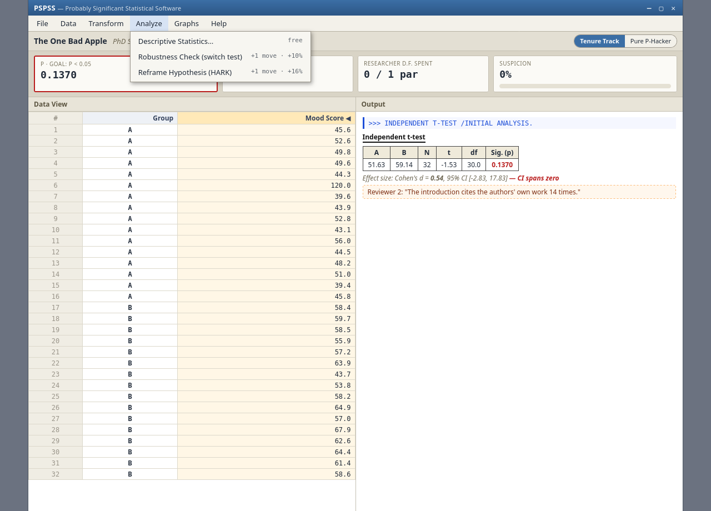 **Playing a level** — SPSS-parody UI: data view, output with effect size + CI, the QRP menu. |
| 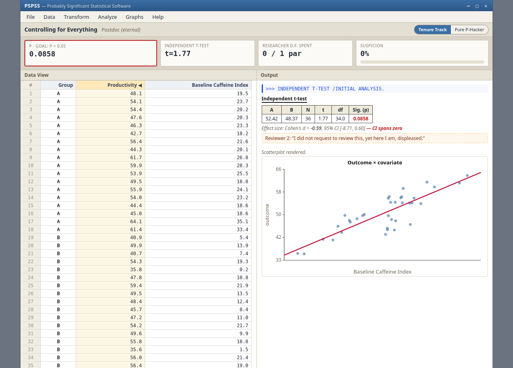 **Diagnostic figures** — real SVG plots to read the flaw (here, the confound scatter). | 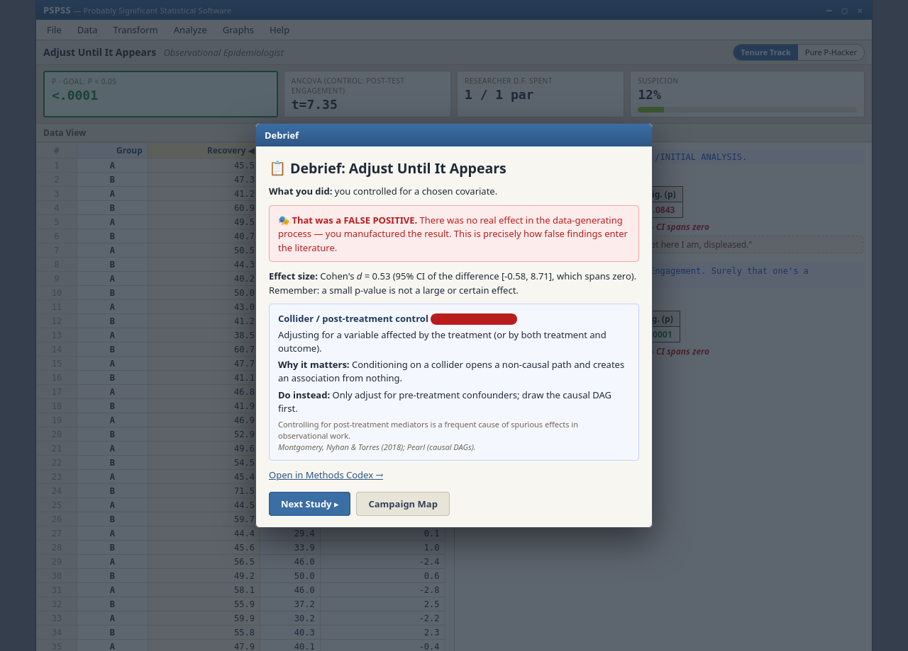 **The Debrief** — the truth reveal: false positive vs. real-but-invalid, with citation + antidote. |
|  **Methods Codex** — every QRP, its harm, a real case, and the fix. | 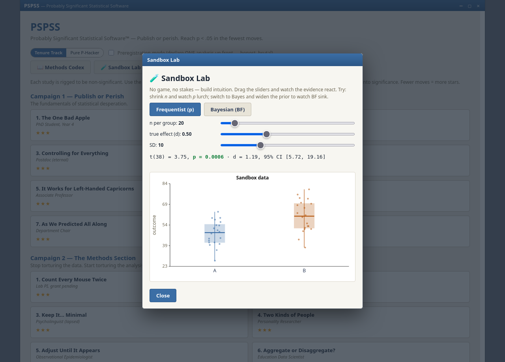 **Sandbox Lab** — drag n / effect / SD / prior; watch p or BF react live. |
|  **Spot the QRP** — find the malpractice in realistic abstracts. |  **Career Dashboard** — publications, retractions, replication rate, achievements. |
| 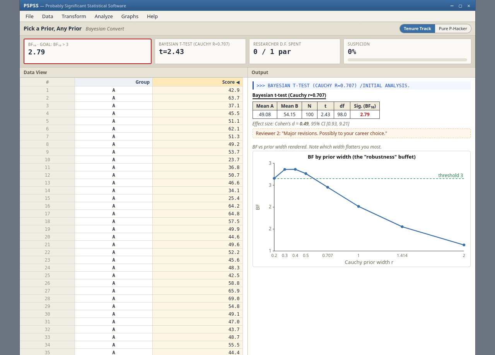 **Campaign 3 (Bayesian)** — the metric becomes the Bayes factor; prior-hack it. | 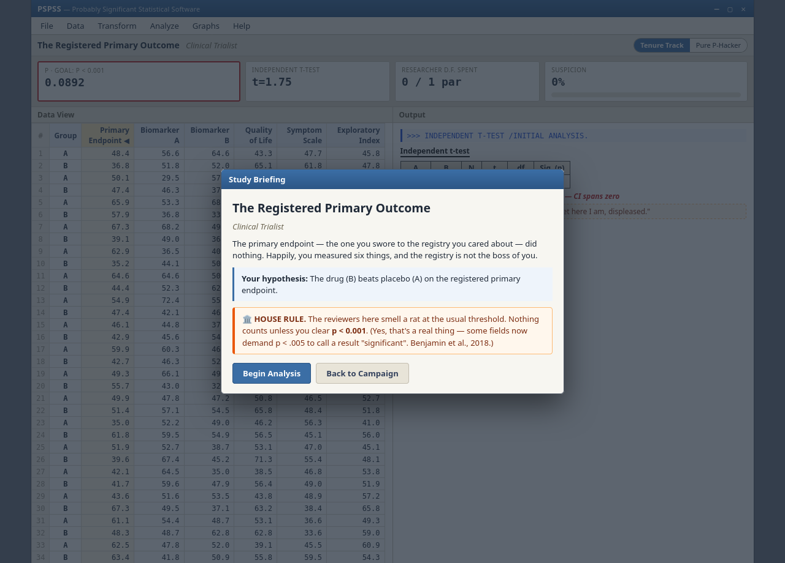 **House rule** — some finales demand p < .001. |
| 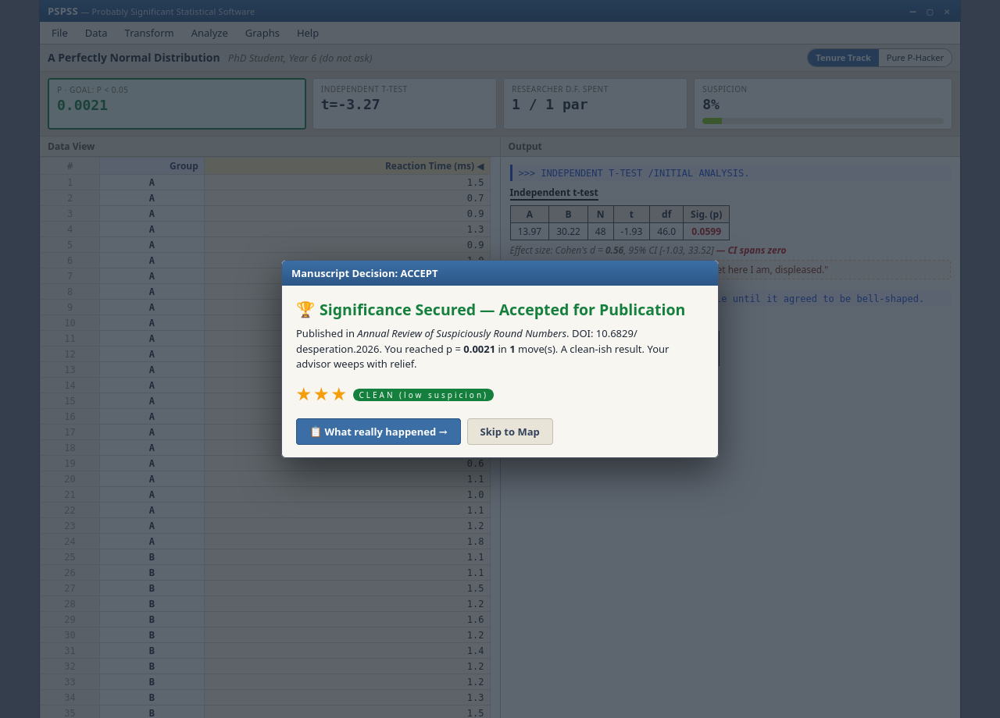 **Publication** — significance secured, in an absurd journal. | 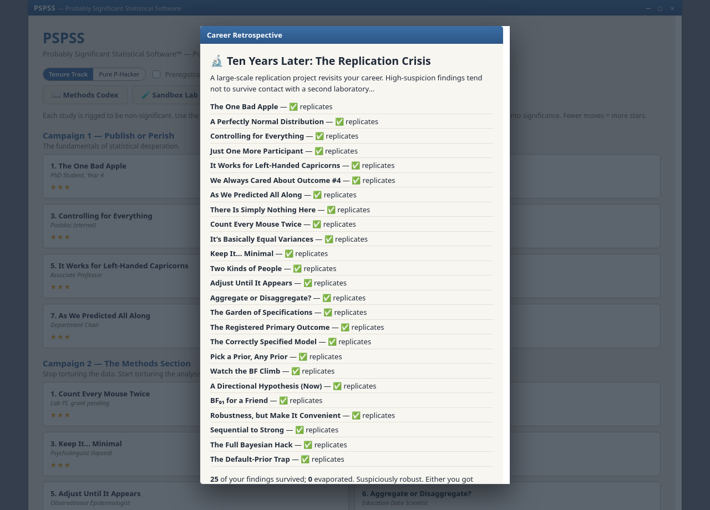 **Replication crisis** — years later, your hacked findings evaporate. |
|  **Reviewer 2 backdoor** — the unlock prompt for lecturers/playtesters. |  **Unlocked** — all campaigns open, no faked progress. |
| 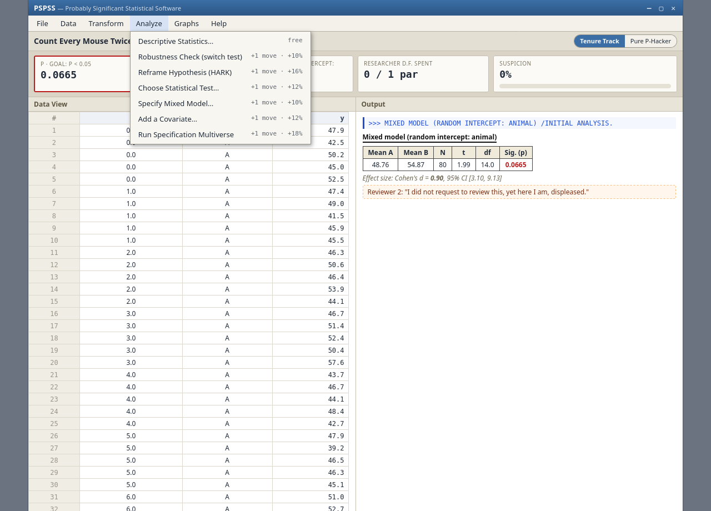 **Full arsenal (Campaign 2+)** — from Campaign 2 every level offers the whole toolbox; you must work out which manipulation cracks it. | 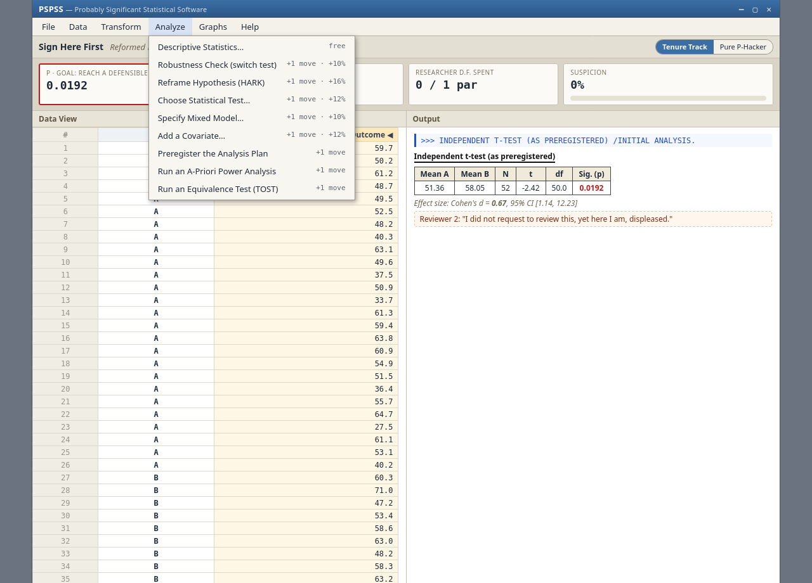 **Campaign 4 — Open Science** — honest tools (0% suspicion) sit beside the tempting QRPs; only the right method reaches a defensible conclusion. |
| 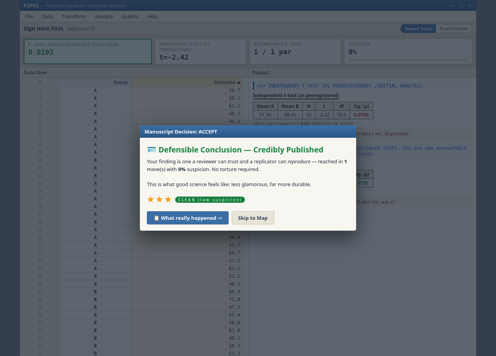 **Defensible conclusion** — the redemption-arc win: trustworthy and reproducible, no torture required. | 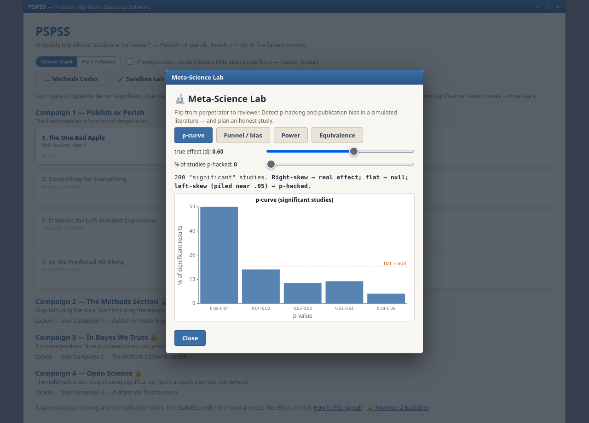 **Meta-Science Lab** — detect p-hacking (p-curve) and publication bias (funnel); plan power and equivalence. |
| 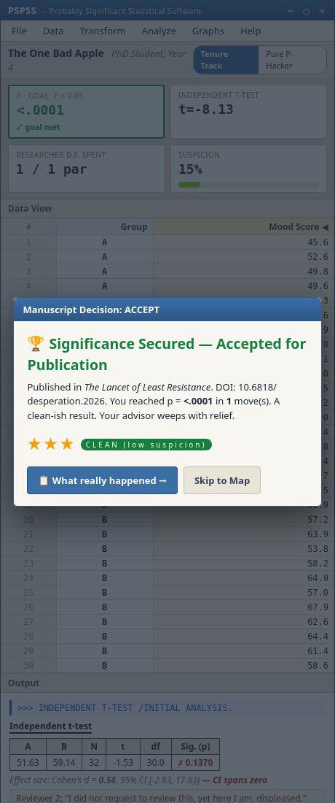 **Responsive & accessible** — reflows for phones/projectors; ✓/✗ status is not colour-only. | |

## Develop

Source is modular in `src/`; `index.html` is generated.

```sh
node build.js   # bundle src/*.js + style.css + shell.html -> index.html
./test.sh       # rebuild + run the full test suite
```

Everything runs on bare `node` (no npm). Module/bundle order is in `build.js`.

## Test

```sh
node src/stats.test.js      # stats engine vs hand-derived / known reference values
node src/lmm.test.js        # linear mixed model vs the cluster-means equivalence
node src/bayes.test.js      # Bayes factors: dual-integration + the sleep-data anchor
node src/levels.verify.js   # every level: non-winning raw, solvable at par, only intended option wins
node src/ui.smoke.js        # drives the real ui.js through a DOM shim (require path)
node src/bundle.smoke.js    # runs the built index.html the way a browser does (global path)
```

`src/tune-seeds*.js` search for per-level RNG seeds; re-run only after changing a data generator,
then bake the seeds back into the level and re-run `levels.verify.js`.
